# Microcontroller_pcb

Kicad files for our microcontroller pcb

## Schematic

In the picture below you can see the schematic off the main board
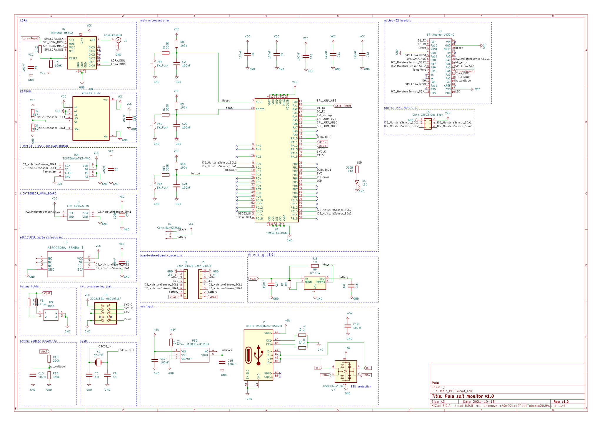

## Pictures

| Front | Back |
|---|---|
|In this picture you can see the front of the pcb|In this picture you can see the back of the pcb
|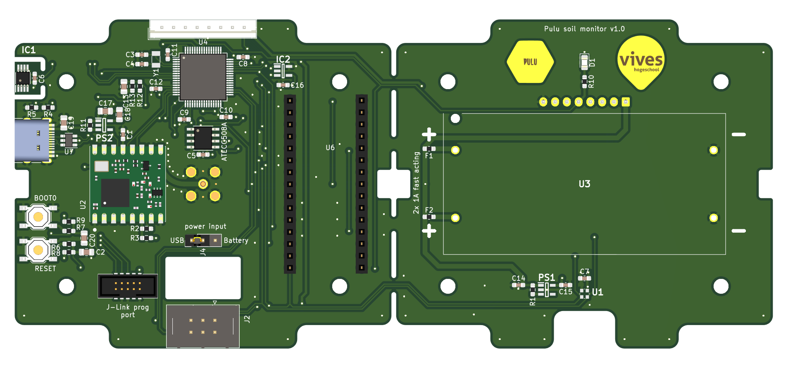 | 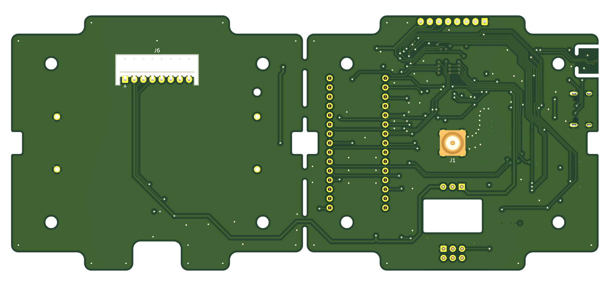 |

## Components

- STM32L476RGT

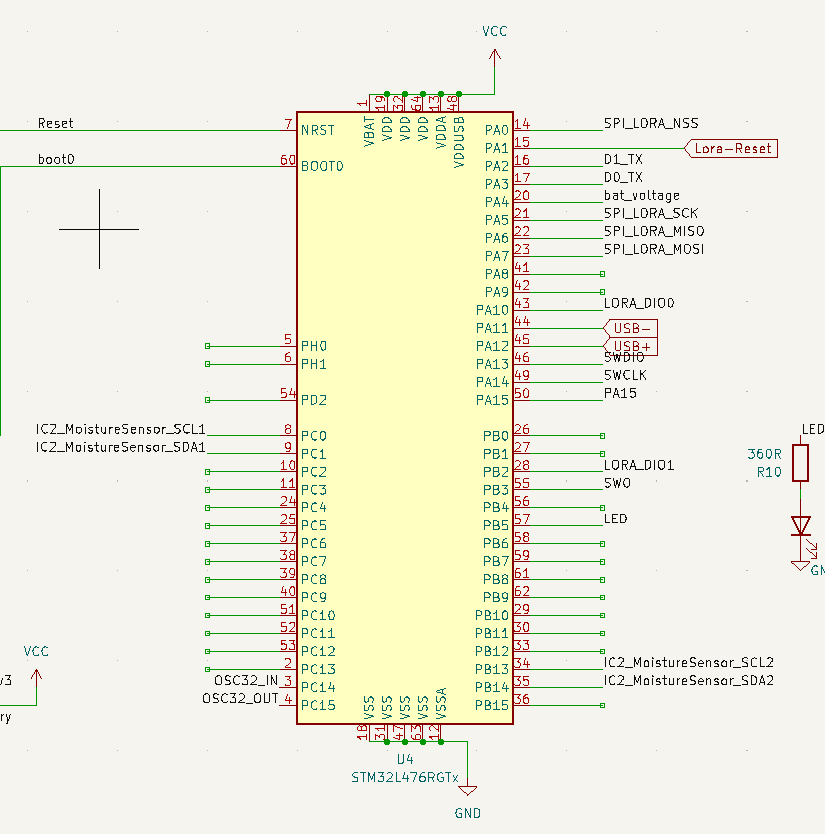

- 32768 Crystal

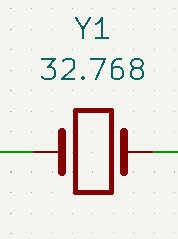

- ESD Protection(USBLC6-2SC6)

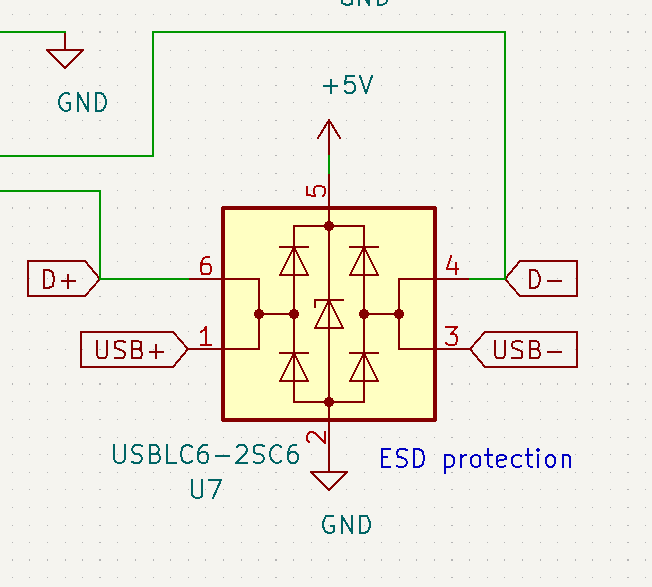

- L432KC pin layout

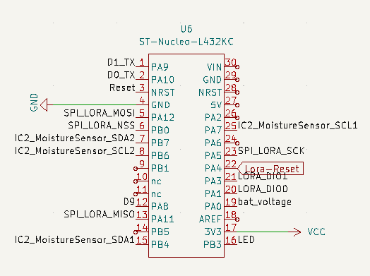

- Cryptochip (ATTEC508A)

- Batteryholder(1013)

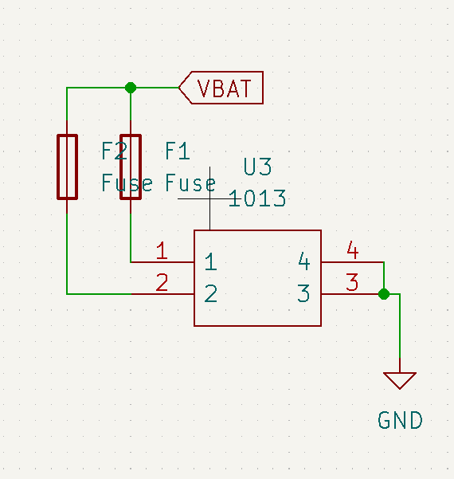

- LoraModule (RFM95W)

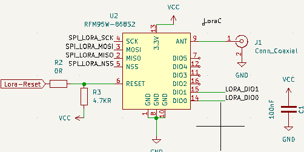

- Lichtsensor (LTR-329ALS)

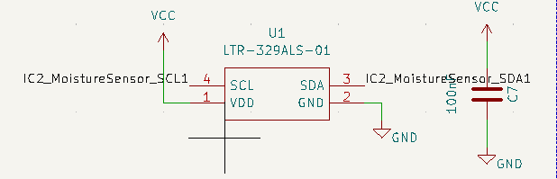

- 2x Button switch SMD

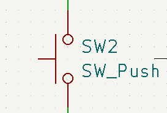

- 18x 100nF (0603) condensatoren

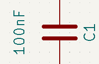

- 2x 4pf (0603) Condensator bij crystal

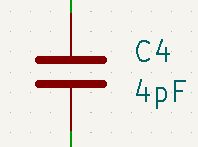

- LED SMD (0805)

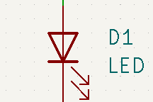

- 2x Fuse (0603)

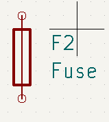

- Temperaturesensor TCN75AVUA713-VAO

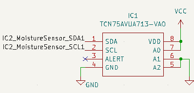

- EEPROM geheugen 24AA64T

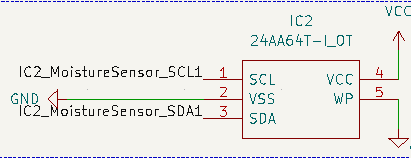

- Connector Antenne SMA_Amphenol

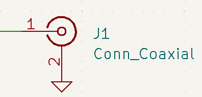

- Connector voor moisture 2x03 2.54mm

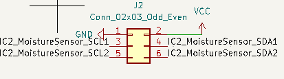

- USB-C Connector 2.0 Type-c-31-m-12

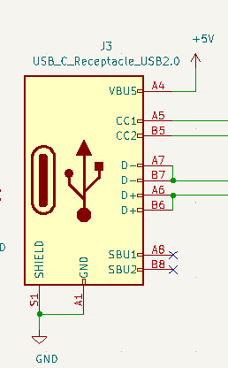

- Connector voor batterij 1x03 2.54mm

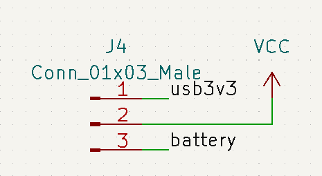

- 2x Connector Molex 1x08 2.00mm

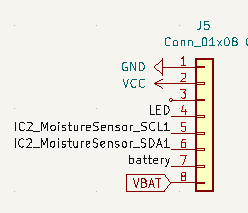

- SWD Programming port (20021521-00010T1LF)

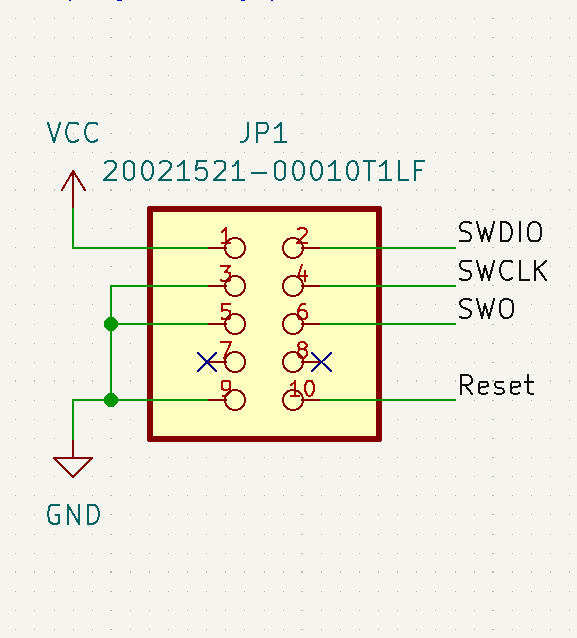

- 2x LDO (PS1 S-1318B33-M5T1U4)

- 1x 4.7kΩ

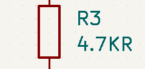

- 2x 5.1kΩ

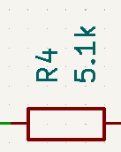

- 3x 360Ω

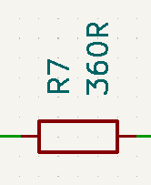

- 2x 100kΩ

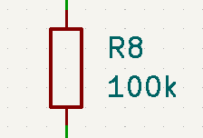

- 1x 220kΩ

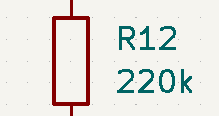

- 1x 330kΩ

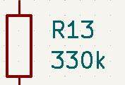
