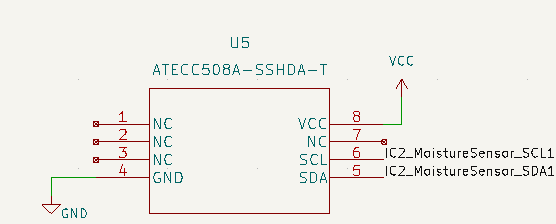
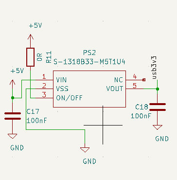

# Microcontroller_pcb

Kicad files for our microcontroller pcb

## Schematic

In the picture below you can see the schematic off the main board

## Pictures

| Front | Back |
|---|---|
|In this picture you can see the front of the pcb|In this picture you can see the back of the pcb
| |  |

## Components

- STM32L476RGT

- 32768 Crystal

- ESD Protection(USBLC6-2SC6)

- L432KC pin layout

- Cryptochip (ATTEC508A)

- Batteryholder(1013)

- LoraModule (RFM95W)

- Lichtsensor (LTR-329ALS)

- 2x Button switch SMD

- 18x 100nF (0603) condensatoren

- 2x 4pf (0603) Condensator bij crystal

- LED SMD (0805)

- 2x Fuse (0603)

- Temperaturesensor TCN75AVUA713-VAO

- EEPROM geheugen 24AA64T

- Connector Antenne SMA_Amphenol

- Connector voor moisture 2x03 2.54mm

- USB-C Connector 2.0 Type-c-31-m-12

- Connector voor batterij 1x03 2.54mm

- 2x Connector Molex 1x08 2.00mm

- SWD Programming port (20021521-00010T1LF)

- 2x LDO (PS1 S-1318B33-M5T1U4)

- 1x 4.7kΩ

- 2x 5.1kΩ

- 3x 360Ω

- 2x 100kΩ

- 1x 220kΩ

- 1x 330kΩ

